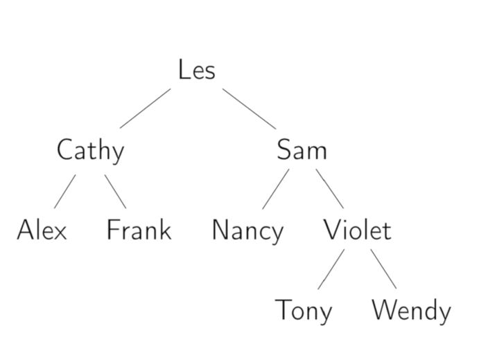

# Data Structures Fundamentals

> A data structure ("DS" as it is often abbreviated) is a specialized format to organize, process, retrieve and store data.

## Array

It's a contiguous area of memory, contaning equally-sized elements indexed by contiguous integers, most progamming languages have zero-indexed arrays (the index corresponding to the first element is zero). With arrays, **we get constant access time to the elements**, since we know the starting address of the array, and the size of the elements contained, so a basic operation is required to find the desired element based on its index.

To add or remove an element at the end of an array, we get contant time (O(1)). To add or remove an alement at any other arbitrary location we get linear time (O(n)).

  

    

## Linked list

A linked list is a chain of nodes, each node contains a data field and a reference (link) to the next node in the list (this in the case of a singly-linked list). The difference with an array is that, in a linked list, **the elements are not stored in contiguous memory locations, that's why we need to store the location of the next node that continues our list**.

### Singly-linked list

This type of linked list can only be traversed in one direction, from head to tail, this is because in each node we are only storing the location of the **next** node in the list, that's why if we find ourselves in some particular node, we can't know what's the location of the previous item of the list, we don't have that information.

  

    

### Doubly-linked list

With a doubly-linked list we do have **both the reference to the next and previous node**, which simplifies some operations in this data structure, like inserting a new node before a specific node, at the expense of storing this additional pointer to the previous node.

  

    

## Stack

A stack is an abstract data type for which we can add new keys to the 'top' of the collection, we can return the most recently-added key (the one at the top), we can remove and return this 'top' item or key, and finally we can check if the stack is empty. We can implement a stack using an array or a singly-linked list. A stack follows a "LIFO" (Last In First Out) behavior.

## Queue

A queue, just like a stack, is an abstract data type, they are almost identical except for the fact that a queue follows a "FIFO" (First In First Out) pattern, we can add a new key at the 'end' of the collection, we can return the 'oldest' key available (next one in the queue), we can remove and return this oldest element, and finally we can check if the queue is empty. We can implement a queue using an array with two variables so we know the next index to read and write, or a singly-linked list with a tail pointer to add new elements to the list in constant time. **Using the array, we have a maximum size that the queue can grow to, so it's bounded**.

## Tree

It's an abstract data type that represents a hierarchical tree structure with a set of connected nodes.

  

    

**Depth-first search**: We completely traverse one sub-tree before exploring a sibling sub-tree.

**Breadth-first search**: We traverse all nodes at one level before progressing to the next level, that's to say, we look at all child nodes of our current node before going deeper.

