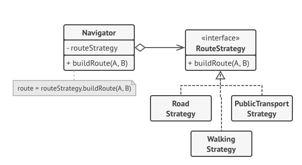

# Design patterns

**What is a design pattern?**

A software design pattern is basically a **technique**, a reusable solution of how to solve a common problem when designing an application or system. Unlike a library or framework, which can be inserted and used right away, a design pattern is more of a template to approach the problem at hand.

There are three different types of design patterns

- **Creational design patterns** deal with object creation and initialization, providing guidance about which objects are created for a given situation. These design patterns are used to increase flexibility and to reuse existing code.

- **Structural design patterns** deal with class and object composition, or how to assemble objects and classes into larger structures.

- **Behavioral design patterns** are concerned with communication between objects and how responsibilities are assigned between objects.

<div style="page-break-after: always;"></div>

## Singleton

The *singleton* design pattern aims to use only a singular instance of a class across the application, it is a **creational** design pattern. Basically the approach is to have a static property in the class that holds the single instance, and in the constructor generate said single instance if it hasn't been created yet and assign it to the static field, otherwise, simply return the already created single instance.

Example in JavaScript

```js
class Singleton {
    
    static instance = null;

    constructor() {

        this.random = Math.random();

        if (Singleton.instance) {
            // We check if our static property already contains the single instance
            //if so, simply return that single instance
            return Singleton.instance;
        }

        // If we skip the if, meaning our single instance is not yet assigned,
        // we assign it, using the current object (this)
        Singleton.instance = this;

    }
}
```

Now, using the *random* property in the class, we'll see that we are getting the same instance every time:

```js
for (let i = 1; i <= 10; i ++) {
    let currentSingleton = new Singleton();
    console.log(`Singleton ${i}. Random: ${currentSingleton.random}`);
}
```

<div style="page-break-after: always;"></div>

Output

```console
Singleton 1. Random: 0.23071954710893583
singleton.js:99 Singleton 2. Random: 0.23071954710893583
singleton.js:99 Singleton 3. Random: 0.23071954710893583
singleton.js:99 Singleton 4. Random: 0.23071954710893583
singleton.js:99 Singleton 5. Random: 0.23071954710893583
singleton.js:99 Singleton 6. Random: 0.23071954710893583
singleton.js:99 Singleton 7. Random: 0.23071954710893583
singleton.js:99 Singleton 8. Random: 0.23071954710893583
singleton.js:99 Singleton 9. Random: 0.23071954710893583
singleton.js:99 Singleton 10. Random: 0.23071954710893583
```

We get the same random number every time, this is due to the fact that we are getting the exact same instance of the class because of the static *instance* property and the code in the constructor. **We are just asking if we already have the single instance, if we do, we return it when creating the new object, if we don't we get the current instance in the constructor and we assign it to the static property**.

Another thing we can do is verifying if we have the exact same instance using the strict comparison:

```js
const singleton1 = new Singleton();
const singleton2 = new Singleton();

console.log(`Are they the exact same instance? ${singleton1 === singleton2}`);
```

Output

```console
Are they the exact same instance? true
```

<div style="page-break-after: always;"></div>

Now let's see how we can structure a *singleton* using TypeScript, which is very similar to the way we've done it using JavaScript, except we can take advantage of the benefits TypeScript offers us, like the visibility modifiers for the properties and methods of the class.

```ts
class Singleton {

    private static instance: Singleton;
    private static instanceCount: number = 0;
    public random: number;

    private constructor() {
        this.random = Math.random();
    }

    public static getInstance(): Singleton {

        Singleton.instanceCount++;

        if (!Singleton.instance) {
            Singleton.instance = new Singleton();
        }

        return Singleton.instance;
    }

    public static getInstancesCount(): number {
        return Singleton.instanceCount;
    }

}
```

In this implementation, we are restricting the use of the class' constructor outside of the own class, since it has the *private* visibility modifier we can access said constructor exclusively in the context of the class, that's why we have the *getInstance* static method, which will be the intermediary so we can get a "new" instance of this class. In this *getInstance* method we are checking if we already have our single instance hosted in the *instance* private static property, we've made this *instance* static property private so it can't be modified by mistake outside of our *getInstance* method, since its assignment to an actual instance should happen only once, this way we are careful, we are not exposing the core of the *singleton* to external processes.

Again we've added a *random* public property, to verify that we are actually getting the exact same instance (our single instance) every time, and also an *instanceCount* static counter was added so we can know how many times we've invoked the *getInstance* method at any point.

<div style="page-break-after: always;"></div>

Now, invoking *getInstance* multiple times, we'll see once again that we obtain the same random number each time, since we are getting the exact same instance of our singleton class:

```ts
for (let i = 1; i <= 10; i++) {
    let currentSingleton = Singleton.getInstance();
    console.log(`We have asked for ${Singleton.getInstancesCount()} instance(s) of the singleton!`);
    console.log(`Yet the random number of the singleton is: ${currentSingleton.random}`);
}
```

Output

```console
We have asked for 1 instance(s) of the singleton!
Yet the random number of the singleton is: 0.4848404541144413
We have asked for 2 instance(s) of the singleton!
Yet the random number of the singleton is: 0.4848404541144413
We have asked for 3 instance(s) of the singleton!
Yet the random number of the singleton is: 0.4848404541144413
We have asked for 4 instance(s) of the singleton!
Yet the random number of the singleton is: 0.4848404541144413
We have asked for 5 instance(s) of the singleton!
Yet the random number of the singleton is: 0.4848404541144413
We have asked for 6 instance(s) of the singleton!
Yet the random number of the singleton is: 0.4848404541144413
We have asked for 7 instance(s) of the singleton!
Yet the random number of the singleton is: 0.4848404541144413
We have asked for 8 instance(s) of the singleton!
Yet the random number of the singleton is: 0.4848404541144413
We have asked for 9 instance(s) of the singleton!
Yet the random number of the singleton is: 0.4848404541144413
We have asked for 10 instance(s) of the singleton!
Yet the random number of the singleton is: 0.4848404541144413
```

<div style="page-break-after: always;"></div>

## Strategy

*Strategy* is a behavioral design pattern that allows us to define a family of algorithms or behaviors to handle similar related scenarios that require different strategies. This pattern suggests that you take a class that does something specific in a lot of different ways and extract all of these different behaviors into separate classes called strategies.

This pattern must be applied when we have an algorithm, process or solution that is prone to frequent changes, or that may be a massive conditional where according to some condiiton a certain variant of this algorithm/solution is selected at runtime, **we are choosing the correct specific strategy according to the scenario, instead of having a gigantic, unreadable and hard-to-maintain singular strategy that handles all cases**.

In this pattern, the original class is called the *context*, it has a field for storing a reference to one of the strategies (we'll update this field so we can use the appropriate strategy in the context according to the scenario). The context isn't responsible for selecting the appropriate strategy for the job, instead the client sets the desired strategy in the context. In fact, the context doesn't know much about strategies. It works with all strategies through the same generic interface, which only exposes a single method for triggering the algorithm/process encapsulated within the selected strategy.

The *context* class is always independent of concrete strategies, so we can add new strategies or modify existing ones without changing the code of the context or other strategies.

Example diagram of a strategy design pattern implementation

<p align="center">
  
</p>

<div style="page-break-after: always;"></div>

Example of a small implementation of the *strategy* design pattern in TypeScript

```ts
interface Strategy {
    applySolution(data: string[]): string[]; 
}

class Context {
    private strategy: Strategy;

    constructor(strategy: Strategy) {
        this.strategy = strategy;
    }

    public setStrategy(strategy: Strategy) {
        this.strategy = strategy;
    }

    public applySolution(data: string[]): void {
        console.log('Context: Sorting data using the strategy I have been set, not sure hot it will do it');
        const result = this.strategy.applySolution(data);
        console.log(`After the strategy's specific solution: ${result}`);
    }
}

class OrderredStrategy implements Strategy {
    public applySolution(data: string[]): string[] {
        return data.sort();
    }
}

class ReverseStrategy implements Strategy {
    public applySolution(data: string[]): string[] {
        return data.sort();
    }
}
```

We can see our context class has a private property to host the strategy object, coming from a class that must implement the *Strategy* interface declared at the beginning, this interface exposes only that solution method that is different with every strategy, in the context class we are just directly invoking that method from the strategy. Basically this is allowing us to have a different behavior in the context class depending on the situation, but it wouldn't be a great idea to include every particular solution inside of a single class, that's why we can have every particular solution/algorithm/method separated inside of a strategy class of its own.

<div style="page-break-after: always;"></div>

## Observer

*Observer* is a behavioral design pattern that allows us to define a subscription mechanism to notify multiple observer objects about any events or state changes that happen to the object they are observing (*subject* or *publisher*).

Whenever an important event happens to the *subject* or *publisher*, it goes over its subscribers and calls the specific notification method on their objects.

In reality, for an application, we may have several different types of observers that are interested in tracking events of the same subject or publisher. It would be a terrible idea to couple the subject/publisher class with all of these different observer types, you might not even be aware about some of them beforehand if your subject/publisher is supposed to be used by other people, **that's why it's crucial that all different observer classes implement the same interface and that the publisher communicates with them only via that interface**.

Example implementation of this pattern in TS

```ts
interface IObserver<T> {
    refresh(value: T): void;
}

interface ISubject<T> {
    observers: IObserver<T>[];

    subscribe(observer: IObserver<T>): void;
    unsubscribe(observer: IObserver<T>): void;
    notify(value: T): void;
}

class Subject<T> implements ISubject<T> { 
    public observers: IObserver<T>[];

    constructor() { this.observers = []; }

    public subscribe(observer: IObserver<T>) {
        this.observers.push(observer);
    }
    public unsubscribe(observer: IObserver<T>) {
        this.observers = this.observers.filter(obs => obs !== observer);
    }
    public notify(value: T) {
        console.log(`I, the subject, am notifying to the observers that are pending on the changes of my state with a new value: ${value}`);
        this.observers.forEach(obs => obs.refresh(value));
    }
}
```
<div style="page-break-after: always;"></div>

```ts
class Observer<T> implements IObserver<T> {
    private fn: (value: T) => void;
    private name: string;

    constructor(fn: (val: T) => void, name: string) {
        this.fn = fn;
        this.name = name;
    }

    refresh(value: T): void {
        console.log();
        console.log('*****');
        console.log(`${this.name}, I was notified of a new value by the subject.`);
        this.fn(value);
        console.log('*****');
        console.log();
    }
}
```

Here we have our subject/publisher class that has the methods to subscribe and unsubscribe observers to it and we have the *notify* method, which is the process with which we'll let all subscribed observers know that there was a state change in the subject, this method simply iterate over all susbcribed observers and invokes their *refresh* method, which is the observer method that performs the action with the updated information about the state of the subject.

In the observer class, in the constructor, we are receiving the function that will get executed when *refresh* is invoked by the subject, in this sense, we are able to freely define in the observer's creation the behavior this observer will have with the subject data it receives. We can also note that we have defined generic interfaces for both the *subject* and *observers*, mainly to match the data type that the subject will be publishing with the one the observer will be receiving.

<div style="page-break-after: always;"></div>

Now, we can see the behavior of the pattern with the following code:

```ts
const mySubject = new Subject<number[]>();

const observer1 = new Observer<number[]>((notifiedValue) => {
    console.log(`The state I got: ${notifiedValue}`);
    const average = notifiedValue.reduce((ac, current) => ac + current, 0) / notifiedValue.length; 
    console.log(`I calculate the average of the state: ${average}`);
}, 'Observer number 1');

const observer2 = new Observer<number[]>((notifiedValue) => {
    console.log(`The state I got: ${notifiedValue}`);
    console.log(`I do nothing to the state: ${notifiedValue}`);
}, 'Observer number 2');

const observer3 = new Observer<number[]>((notifiedValue) => {
    console.log(`The state I got: ${notifiedValue}`);
    const sum = notifiedValue.reduce((ac, current) => ac + current, 0);
    console.log(`I calculate the sum of the state: ${sum}`);
}, 'Observer number 3');

mySubject.subscribe(observer1);
mySubject.subscribe(observer3);

mySubject.notify([5, 7, 3]);
mySubject.notify([4, 28, 16]);
```

Output

```console
I, the subject, am notifying to the observers that are pending on the changes of my state with a new value: 5,7,3

*****
Observer number 1, I was notified of a new value by the subject.
The state I got: 5,7,3
I calculate the average of the state: 5
*****


*****
Observer number 3, I was notified of a new value by the subject.
The state I got: 5,7,3
I calculate the sum of the state: 15
*****
```

<div style="page-break-after: always;"></div>

```console
I, the subject, am notifying to the observers that are pending on the changes of my state with a new value: 4,28,16

*****
Observer number 1, I was notified of a new value by the subject.
The state I got: 4,28,16
I calculate the average of the state: 16
*****


*****
Observer number 3, I was notified of a new value by the subject.
The state I got: 4,28,16
I calculate the sum of the state: 48
*****
```

We can see that every time we invoke the *notify* method in the subject/publisher, all of the subscribed observers are being notified, and they receive the information regarding the state change and handle it their own way, according to what we defined in the function that is the argument to the observer's constructor, that's the function that gets executed in the observer's *refresh* method, with the data that comes from the subject. We can also appreciate that even when *observer2* has been created, it just doesn't do anything because we didn't subscribe that specific observer to our subject.